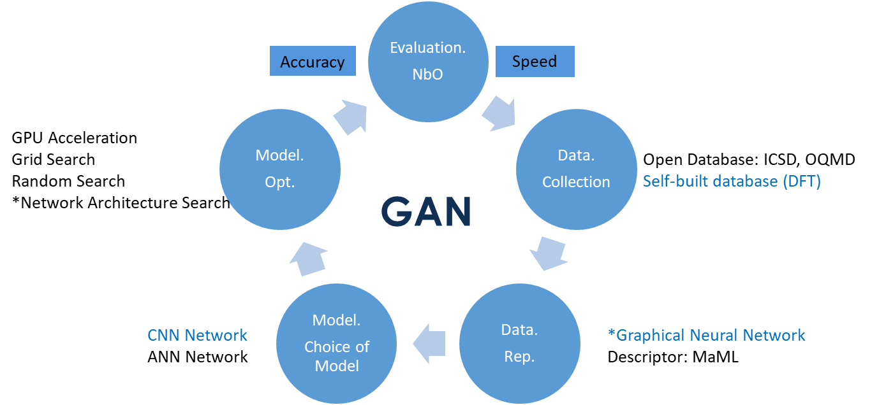

Crystal GAN project is originally a thesis of Shubo Liu. It is supervisered by Zhenwei Li (Northwestern Polytechnical Univeristy) and [Lei Su](https://www.sems.qmul.ac.uk/staff/research/l.su) (Queen Mary University of London). 

Triditional way of new material discovery consists of first principle based high thoughout computation, chemical synthesis and characterization. Both of which is time-comsuming process. The introduction of machine learning accelerates the discovering process of new materials (structures) significantly. 

As a sub-branch of machine learning and a further development on perceptron, deep learning finds its specialization in data based learning, which was initially brought in by McCulloch and Pitts in 1940s when they were hoping to propose a system to mimic neurons of human brain. Thanks to the continuous efforts of AI engineers and data scientists, deep learning has been promising to learn from data in an accurate and computationally efficient manner. 

In computational material area, DFT based electronic calculation has brought fundamental changes to materi al simulation and discovery, but soon they were found to be stuck by bottleneck at computat ional efficiency (typically in $ O(n^3) $ scaling factor with increasing system simulation size). Machine learning is thus the best approach to make up for the shortcomings of DFT but integrate its advantages. And due to these reasons, using ML/DL to explore material space has become one of hot researching fields.

This research aims to design and implement a Generative-Adversarial-Networks (GAN)-based machine learning framework to effectively predict material structures while taking NbO system as an example to testify the machine learning framework.

Generative Adversarial Network is firstly brought in October 2014, by Goodfellow. GAN model usually contains two main sub-networks: generator and discriminator. As their name suggested, the function of them is to generate data and discriminate the authenticity of generated data. They two constitute a typical dynamic two-player zero-benefit gaming process. Just like two boxers fighting with each other, both of which will improve themselves during the fighting. Based on the same principle, this thesis hopes to train a GAN model to “learn” the rule of crystal structure and predict new structure.
